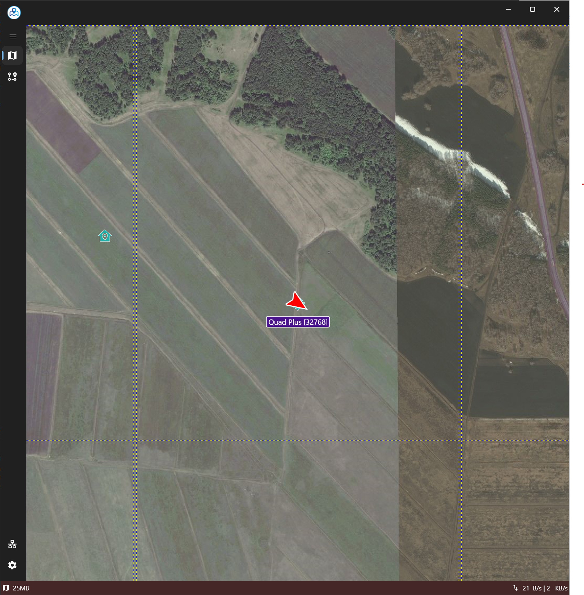
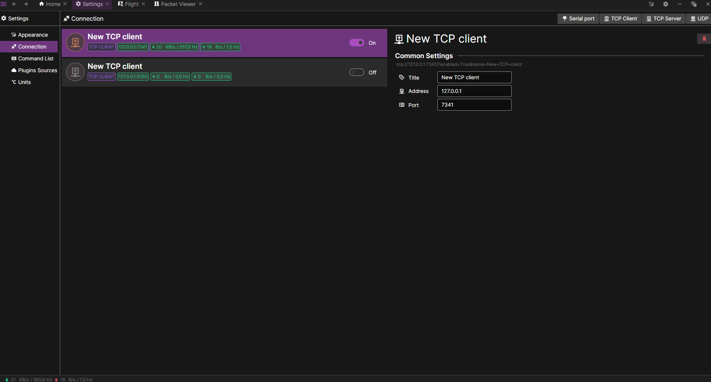
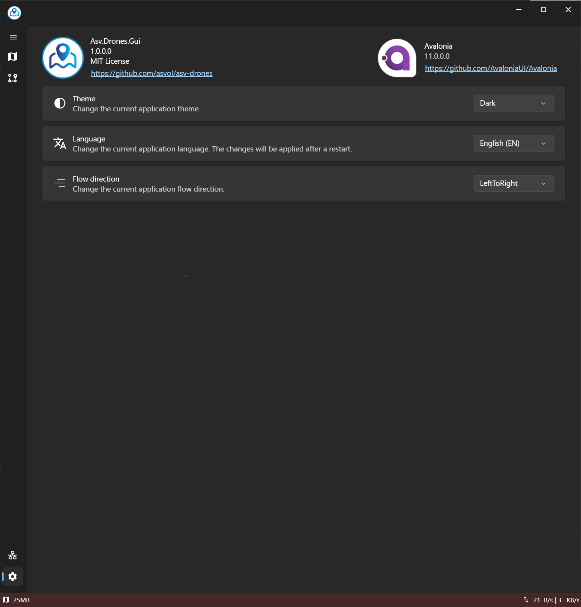

# asv-drones
Open source user-friendly software solution designed to provide remote control and monitoring of drones, payloads and RTK base stations. The app allows users to easily navigate their drone using an intuitive interface and access real-time data such as flight paths, altitude, and speed. The app is compatible with a wide range of drones and can be installed on Windows, Linux, MacOS devices.

