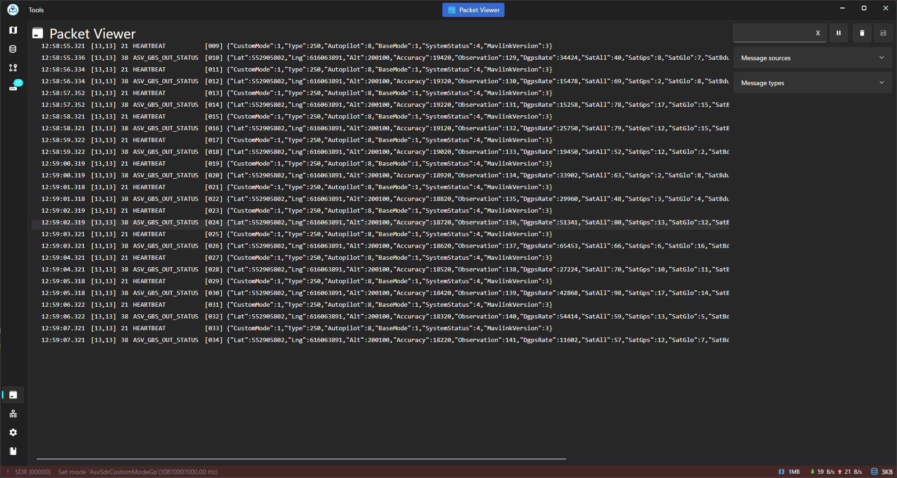

[//]: [](https://github.com/asv-soft/asv-drones/actions/workflows/ReleaseDeployAction.yml)

## 1. Introduction

Asv.Drones: Empowering Innovation in Unmanned Aerial Systems

Welcome to Asv.Drones, an advanced and modular open-source application designed to revolutionize the field of Unmanned Aerial Systems (UAS). 
Committed to fostering innovation and collaboration, Asv.Drones is not just a drone application; it's a community-driven platform that opens the doors to limitless possibilities.

Key Features:

1. **Modularity:**
   Asv.Drones embraces a modular architecture, allowing users to tailor the application to their specific needs. Each module serves a distinct purpose, contributing to the overall functionality and versatility of the platform.

2. **Open Source Philosophy:**
   Transparency and collaboration lie at the heart of Asv.Drones. The entire application, along with its constituent modules, is open source. This means that not only can users benefit from the software, but they can also actively contribute to its enhancement and evolution.

3. **Modules Overview:**

  - **[Asv.Drones.Gbs](https://github.com/asv-soft/asv-drones-gbs) (Ground Base Station Service):**
    This module provides a robust ground base station service, ensuring seamless communication between the drone and the operator on the ground. Open source nature encourages customization for specific ground station requirements.

  - **Obsolete [Asv.Drones.Sdr](https://github.com/asv-soft/asv-drones-sdr) (SDR Payload Example Project):**
    Explore the possibilities of Software-Defined Radio (SDR) payloads with this open-source example project. Asv.Drones.Sdr serves as a foundation for integrating cutting-edge SDR technologies into unmanned aerial systems.

  - **[Asv.Gnss](https://github.com/asv-soft/asv-gnss) (GNSS Library):**
    The Asv.Gnss module is a comprehensive GNSS library that parses RTCMv2, RTCMv3 and NMEA protocols. It goes a step further by providing control over receivers through SBF, ComNav and UBX protocols, all tailored for .NET environments.

  - **[Asv.Mavlink](https://github.com/asv-soft/asv-mavlink) (MAVLink Library for .NET 9.0):**
    For seamless communication and control, Asv.MAVLink is a dedicated library compatible with .NET 9.0. It ensures that your drone's communication adheres to the MAVLink protocol standards.

  - **[Asv.Common](https://github.com/asv-soft/asv-common):**
    Asv.Common serves as the backbone, offering common types and extensions for all Asv-based libraries. It streamlines development, ensuring consistency and efficiency across different modules.

  - **[Asv.Avalonia](https://github.com/asv-soft/asv-avalonia):**
    Asv.Avalonia is a custom framework built on top of Avalonia. It defines the fundamental rules for cross-platform applications and allows for their rapid assembly. 
    Out of the box, the framework provides an event system for ViewModels, a powerful undo/redo mechanism for various user actions, a theme with diverse styles, a cross-platform dialog system and more. 
    Asv.Avalonia features various additional modules that extend its functionality.
    
  Here's a schematic representation of the whole project:
<p align="center">
    
</p>

4. **Community Collaboration:**
   Asv.Drones thrives on community collaboration. Developers, enthusiasts and innovators are encouraged to contribute, share insights and collectively shape the future of unmanned aerial systems.

Embark on a journey of exploration, experimentation and innovation with Asv.Drones. Whether you're a developer, researcher or drone enthusiast, this open-source platform invites you to redefine the possibilities of unmanned aerial systems.

<p align="center">
    
    
    
    
    
</p>

## 2. Different sets of components
Asv.Drones can work with different combinations of its components

### Example Of Usage With GBS

**Ground Base Station Integration:** Asv.Drones offers seamless integration with ground base stations through our proprietary implementation called [Asv.Drones.Gbs](https://github.com/asv-soft/asv-drones-gbs). 
Built to operate via the MAVLink protocol, Asv.Drones.Gbs allows users to remotely manage and monitor drone operations from a centralized platform. 
Moreover, any other ground base station software compatible with MAVLink can seamlessly interface with our application, ensuring flexibility and interoperability across different systems (development of additional UI controls may be required).
With Asv.Drones.Gbs, users can plan missions, monitor telemetry data and adjust flight parameters with ease.
To connect to a gbs, create a new connection (usually tcp) in the connection settings.

<div align="center">
   
</div>

## 3. Getting Started

### Setting Up the Development Environment

To ensure a smooth development experience, follow the steps below to set up your development environment:

### 3.1 Prerequisites:
- **Operating System:** This project is compatible with Windows, macOS and Linux. Ensure that your development machine runs one of these supported operating systems.
- **IDE (Integrated Development Environment):** We recommend using [Visual Studio](https://visualstudio.microsoft.com/) or [JetBrains Rider](https://www.jetbrains.com/rider/) as your IDE for C# development. 
- Make sure to install the necessary extensions and plugins for a better development experience.

### 3.2 .NET Installation:
- This project is built using [.NET 9.0](https://dotnet.microsoft.com/download/dotnet/9.0), the latest version of the .NET platform. 
We recommend installing .NET 9.0 by following the instructions provided on the official [.NET website](https://dotnet.microsoft.com/download/dotnet/9.0).

   ```bash
   # Check your current .NET version
   dotnet --version
   ```

### 3.3 Version Control:
- If you haven't already, install a version control system such as [Git](https://git-scm.com/) to track changes and collaborate with other developers.

### 3.4 Clone the Repository:
- Clone the project repository to your local machine using the following command:

   ```bash
   git clone https://github.com/asv-soft/asv-drones.git
   ```

### 3.5 Restore Dependencies:
- Navigate to the platform project directory and restore the required dependencies. 
There are three possible platform directories to build and debug our app: __Asv.Drones.Desktop__, __Asv.Drones.Android__, __Asv.Drones.iOS__.
Currently, we support only the desktop platform.
For example, we will use __Asv.Drones.Desktop__ platform, so you have to execute the following command:

   ```bash
   cd asv-drones/src/Asv.Drones.Desktop
   dotnet workload restore
   dotnet workload repair
   ```

### 3.6 Build and Run:
- After restoring, you have to build the project to ensure that everything is set up correctly, and if it's not - try to restore workloads again:

   ```bash
   dotnet build
   ```

- Run the project:

   ```bash
   dotnet run
   ```

Congratulations! Your development environment is now set up, and you are ready to start contributing to the project. 
If you encounter any issues during the setup process, refer to the project's documentation or reach out to the development team for assistance.

### Building for Android

Coming soon...

## 4. Code Structure

The organization of the codebase plays a crucial role in maintaining a clean, scalable and easily understandable project. 
This section outlines the structure of our codebase, highlighting key directories and their purposes.

### 4.1 Solution Organization

Our solution is organized the following way:

- **`src/`:** This directory contains the source code of the application. 
The code is further organized into projects, each residing in its own subdirectory. The goal is to promote modularity and maintainability.

  ```
  src/
  ├── Asv.Drones.Android/
  ├── Asv.Drones.Desktop/
  ├── Asv.Drones.iOS/
  ├── Asv.Drones/
  │   ├── Commands/
  │   ├── Controls/
  │   ├── Shell/
  │   └── ...
  └── Asv.Drones.Api/
      ├── Commands/
      ├── Controls/
      ├── Shell/
      └── ...

### 4.2 Naming Conventions

Consistent naming conventions are essential for code readability. 
Throughout the codebase, we follow the guidelines outlined [in our documentation](https://docs.asv.me/use-cases/for-developers)

These conventions contribute to a unified and coherent codebase.

By adhering to this organized structure and naming conventions, we aim to create a codebase that is easy to navigate, scalable and conducive to collaboration among developers.

## 5. Coding Style

Maintaining a consistent coding style across the project enhances readability, reduces errors and facilitates collaboration. 
The following guidelines outline our preferred coding style for C#:

**Note:** We have auto formatters in our project to make your life easier. Read more about them in the husky section.

### 5.1 C# Coding Style

#### 5.1.1 Formatting

- **Indentation:** Use tabs for indentation. Each level of indentation should consist of one tab.
- **Brace Placement:** Place opening braces on the same line as the statement they belong to, and closing braces on a new line.

    ```c#
    // Good
    if (condition)
    {
        // Code here
    }

    // Bad
    if (condition) {
        // Code here
    }
    ```

#### 5.1.2 Naming Conventions

- **Pascal Case:** Use Pascal case for class names, method names and property names.

    ```c#
    public class MyClass
    {
        public void MyMethod()
        {
            // Code here
        }

        public int MyProperty { get; set; }
    }
    ```

#### 5.1.3 Language Features

- **Expression-bodied Members:** Utilize expression-bodied members for concise one-liners.

    ```c#
    // Good
    public int CalculateSquare(int x) => x * x;

    // Bad
    public int CalculateSquare(int x)
    {
        return x * x;
    }
    ```

- **Null Conditional Operator:** Use the null conditional operator (`?.`) for safe property or method access.

    ```c#
    // Good
    int? length = text?.Length;

    // Bad
    int length = (text != null) ? text.Length : 0;
    
    // or
    
    int length = text!.Length;
    ```

#### 5.1.4 Special Cases

Usually you place public members after private members, but we have some exceptions:
- **Page constants:** We place page ids and viewmodel ids at the top of the class.
  ```c#
  public const string PageId = "files.browser";
  public const MaterialIconKind PageIcon = MaterialIconKind.FolderEye;
  ```
- **Export information:** We place export information at the end of the class.
  ```c#
  public override IExportInfo Source => SystemModule.Instance;
  ```

#### 5.1.5 Husky

We use husky to make sure that our code is formatted correctly before committing. You may use it for your own code.

1. Go to the src folder
2. run:
    ```bash
    dotnet tool restore
    ```
3. run (use husky-unix instead of husky if you are on linux or macOS):
    ```bash
    dotnet r husky
    ```
4. run the following command to format the code:
    ```bash
    dotnet husky run
    ```

### 5.2 Documentation

#### 5.2.1 Comments

- **XML Documentation:** Include XML comments for classes, methods, and properties to provide comprehensive documentation.

    ```c#
    /// <summary>
    /// Represents a sample class.
    /// </summary>
    public class SampleClass
    {
        /// <summary>
        /// Calculates the sum of two numbers.
        /// </summary>
        /// <param name="a">The first number.</param>
        /// <param name="b">The second number.</param>
        /// <returns>The sum of the two numbers.</returns>
        public int Add(int a, int b)
        {
            // Code here
        }
    }
    ```

#### 5.2.2 Code Comments

- Use comments sparingly and focus on explaining complex or non-intuitive code sections.

By adhering to these coding style guidelines, we aim to create code that is straightforward to read, understand, and maintain.

## 6. Version Control

Version control is a fundamental aspect of our development process, providing a systematic way to track changes, collaborate with team members and manage the evolution of our codebase. 
We use Git as our version control system.

### 6.1 Branching Strategy

#### 6.1.1 Feature Branches

For each new feature or bug fix, create a dedicated feature branch. 
The branch name should be descriptive of the feature or issue it addresses.

```bash
# Example: Creating a new feature branch
git checkout -b feature/my-new-feature
```

#### 6.1.2 Hotfix Branches

In case of critical issues in the production environment, create a hotfix branch. 
This allows for a quick resolution without affecting the main development branch.

```bash
# Example: Creating a hotfix branch
git checkout -b hotfix/1.0.1
```

### 6.2 Commit Messages

Write clear and concise commit messages that convey the purpose of the change. Follow these guidelines:

- Start with a verb in the imperative mood (e.g., "Add," "Fix," "Update").
- Keep messages short but descriptive.
- Use present tense.
- Use feat, fix or chore prefixes to indicate the type of change.

Example:

```bash
# Good
git commit -m "fix: add user authentication feature"

# Bad
git commit -m "Updated stuff"
```

### 6.3 Pull Requests

Before merging changes into the main branch, create a pull request (PR). 
This allows for code review and ensures that changes adhere to coding standards.

- Assign reviewers to the PR.
- Include a clear description of the changes.
- Ensure that automated tests pass before merging.

### 6.4 Merging Strategy

Adopt a merging strategy based on the nature of the changes:

- **Feature Branches:** Merge feature branches into the main branch after code review and approval.
- **Release Branches:** Merge release branches into the main branch and tag the commit for the release.

```bash
# Example: Merging a feature branch
git checkout main
git merge --no-ff feature/my-new-feature
```

### 6.5 Repository Hosting

Our Git repository is hosted on [GitHub](https://github.com/asv-soft/asv-drones). 
Ensure that you have the necessary permissions and follow the best practices for repository management.

By following these version control practices, we aim to maintain a well-organized and collaborative development process. 

## 7. Build and Deployment

The build and deployment processes are crucial parts of our development workflow. 
This section outlines the steps for building the project and deploying it using GitHub Actions.

### 7.1 Build Process

To compile the project, use the following command:

```bash
dotnet build
```

This command compiles the code and produces executable binaries.

### 7.2 Deployment using GitHub Releases

Our application is deployed using [GitHub Actions](https://docs.github.com/en/actions).

The latest release can be found [here](https://github.com/asv-soft/asv-drones/releases).

## 8. Contributing

We welcome contributions from the community to help enhance and improve our project. 
Before contributing, please take a moment to review this guide.

### 8.1 Code Reviews

All code changes undergo a review process to ensure quality and consistency. Here are the steps to follow:

1. **Fork the Repository:** Start by forking the repository to your own GitHub account.

2. **Create a Feature Branch:** Create a new branch for your feature or bug fix.

   ```bash
   git checkout -b feature/my-feature
   ```

3. **Commit Changes:** Make your changes, commit them with clear and concise messages, and push the branch to your forked repository.

   ```bash
   git commit -m "feat: add new feature"
   git push origin feature/my-feature
   ```

4. **Squash your commit:** Squash your commits into a single commit before submitting a pull request.

 ```bash
   git rebase -i main
   
    # squash your commits into a single commit by leaving the first line as "pick" and changing the rest to "squash"
   
   git push --force
```

5**Open a Pull Request (PR):** Submit a pull request to the main repository, detailing the changes made and any relevant information. Ensure your PR adheres to the established coding standards.

6**Code Review:** Participate in the code review process by responding to feedback and making necessary adjustments. 
Addressing comments promptly helps streamline the review process.

7**Merge:** Once the code review is complete and the changes are approved, your pull request will be merged into the main branch.

### 8.2 Submitting Changes

Before submitting changes, ensure the following:

- **Coding Standards:** Adhere to the coding standards and guidelines outlined in this document.

- **Tests:** If applicable, include tests for your changes and ensure that existing tests pass.

- **Documentation:** Update relevant documentation, including code comments and external documentation, to reflect your changes.

### 8.3 Communication

For larger changes or feature additions, it's beneficial to discuss the proposed changes beforehand. Engage with the community through:

- **Opening an Issue:** Discuss your proposed changes by opening an issue. 
This provides an opportunity for community input before investing significant time in development.

- **Joining Discussions:** Participate in existing discussions related to the project. Your insights and feedback are valuable.

### 8.4 Contributor License Agreement (CLA)

By contributing to this project, you agree that your contributions will be licensed under the project's license. 
If a Contributor License Agreement (CLA) is required, it will be provided in the repository.

We appreciate your contributions, and together we can make this project even better!

## 9. Code Documentation

Clear and comprehensive code documentation is essential for ensuring that developers can easily understand, use and contribute to the project. 
Follow these guidelines for documenting your code:

### 9.1 Inline Comments

Use inline comments to explain specific sections of your code, especially for complex logic or non-intuitive implementations. Follow these principles:

- **Clarity:** Write comments that enhance code comprehension. If a piece of code is not self-explanatory, provide comments explaining the reasoning or intention.

- **Conciseness:** Keep comments concise and to the point. Avoid unnecessary comments that do not add value.

- **Update Comments:** Regularly review and update comments to reflect any changes in the code. Outdated comments can be misleading.

Example:

```c#
// Calculate the sum of two numbers
int CalculateSum(int a, int b)
{
    return a + b;
}
```

### 9.2 XML Documentation

For classes, methods, properties and other significant code elements, use XML documentation comments to provide comprehensive information. Follow these guidelines:

- **Summary:** Provide a summary that succinctly describes the purpose of the class or member.

- **Parameters:** Document each parameter, specifying its purpose and any constraints.

- **Returns:** If applicable, document the return value and its significance.

- **Examples:** Include examples that demonstrate how to use the class or member.

Example:

```c#
/// <summary>
/// Represents a utility class for mathematical operations.
/// </summary>
public class MathUtility
{
    /// <summary>
    /// Calculates the sum of two numbers.
    /// </summary>
    /// <param name="a">The first number.</param>
    /// <param name="b">The second number.</param>
    /// <returns>The sum of the two numbers.</returns>
    public int CalculateSum(int a, int b)
    {
        return a + b;
    }
}
```

### 9.3 Consistency

Ensure consistency in your documentation style across the codebase. 
Consistent documentation makes it easier for developers to navigate and understand the project.

By following these documentation guidelines, we aim to create a codebase that is not only functional but also accessible and easily maintainable for all contributors.

## 10. Security

Ensuring the security of our software is paramount to maintaining the integrity and confidentiality of user data. 
Developers should adhere to best practices and follow guidelines outlined in this section.

### 10.1 Code Security Practices

#### 10.1.1 Input Validation

Always validate and sanitize user input to prevent injection attacks and ensure the integrity of your application.

```c#
// Example for C#
public ActionResult ProcessUserInput(string userInput)
{
    if (string.IsNullOrWhiteSpace(userInput))
    {
        // Handle invalid input
    }

    // Process input
}
```

#### 10.1.2 Authentication and Authorization

Implement secure authentication and authorization mechanisms to control access to sensitive functionalities and data. 
Leverage industry-standard protocols like OAuth when applicable.

#### 10.1.3 Secure Communication

Ensure that communication between components, APIs and external services is encrypted using secure protocols (e.g., HTTPS).

### 10.2 Dependency Security

#### 10.2.1 Dependency Scanning

Regularly scan and update dependencies to identify and address security vulnerabilities. 
Leverage tools and services that provide automated dependency analysis.

#### 10.2.2 Minimal Dependencies

Keep dependencies to a minimum and only include libraries and packages that are actively maintained and have a good security track record.

### 10.3 Data Protection

#### 10.3.1 Encryption

Sensitive data, both at rest and in transit, should be encrypted. Use strong encryption algorithms and ensure proper key management.

#### 10.3.2 Data Backups

Implement regular data backup procedures to prevent data loss in the event of security incidents or system failures.

### 10.4 Secure Coding Standards

Adhere to secure coding standards to mitigate common vulnerabilities. 
Follow principles such as the [OWASP Top Ten](https://owasp.org/www-project-top-ten/) to address security concerns in your codebase.

### 10.5 Reporting Security Issues

If you discover a security vulnerability or have concerns about the security of the project, please report it immediately to our team at [our telegram channel](https://t.me/asvsoft).
Do not disclose security-related issues publicly until they have been addressed.

### 9.6 Security Training

Encourage ongoing security training for all team members to stay informed about the latest security threats and best practices. 
Knowledgeable developers are key to maintaining a secure codebase.

By incorporating security practices into our development process, we aim to create a robust and secure software environment for our users.

## 11. License

This project is licensed under the terms of the MIT License. 
A copy of the MIT License is provided in the [LICENSE](https://github.com/asv-soft/asv-drones?tab=MIT-1-ov-file#) file.

### MIT License

```
MIT License

Copyright (c) 2023 Asv Soft LLC

Permission is hereby granted, free of charge, to any person obtaining a copy
of this software and associated documentation files (the "Software"), to deal
in the Software without restriction, including without limitation the rights
to use, copy, modify, merge, publish, distribute, sublicense, and/or sell
copies of the Software, and to permit persons to whom the Software is
furnished to do so, subject to the following conditions:

The above copyright notice and this permission notice shall be included in all
copies or substantial portions of the Software.

THE SOFTWARE IS PROVIDED "AS IS", WITHOUT WARRANTY OF ANY KIND, EXPRESS OR
IMPLIED, INCLUDING BUT NOT LIMITED TO THE WARRANTIES OF MERCHANTABILITY,
FITNESS FOR A PARTICULAR PURPOSE AND NONINFRINGEMENT. IN NO EVENT SHALL THE
AUTHORS OR COPYRIGHT HOLDERS BE LIABLE FOR ANY CLAIM, DAMAGES OR OTHER
LIABILITY, WHETHER IN AN ACTION OF CONTRACT, TORT OR OTHERWISE, ARISING FROM,
OUT OF OR IN CONNECTION WITH THE SOFTWARE OR THE USE OR OTHER DEALINGS IN THE
SOFTWARE.
```

### Using the MIT License

The MIT License is a permissive open-source license that allows for the free use, modification and distribution of the software. 
It is important to review and understand the terms of the license before using, contributing to or distributing this software.

By contributing to this project, you agree that your contributions will be licensed under the MIT License.

For more details about the MIT License, please visit [opensource.org/licenses/MIT](https://opensource.org/licenses/MIT).

## 12. Contact

If you have questions, suggestions, or need assistance with the project, we encourage you to reach out through the following channels:

### 12.1 Telegram Channel

Visit our Telegram channel: [ASVSoft on Telegram](https://t.me/asvsoft)

Feel free to join our Telegram community to engage in discussions, seek help, or share your insights.

### 12.2 GitHub Issues

For bug reports, feature requests or any project-related discussions, please use our GitHub Issues:

[Project Issues on GitHub](https://github.com/asv-soft/asv-drones/issues)

Our GitHub repository is the central hub for project-related discussions and issue tracking. 
Please check existing issues before creating new ones to avoid duplication.

### 12.3 Security Concerns

If you discover a security vulnerability or have concerns about the security of the project, please report it immediately to our telegram channel: [ASVSoft on Telegram](https://t.me/asvsoft). 
Do not disclose security-related issues publicly until they have been addressed.

### 12.4 General Inquiries

For general inquiries or if you prefer email communication, you can reach us at [me@asv.me](mailto:me@asv.me).

We value your feedback and contributions, and we look forward to hearing from you!
